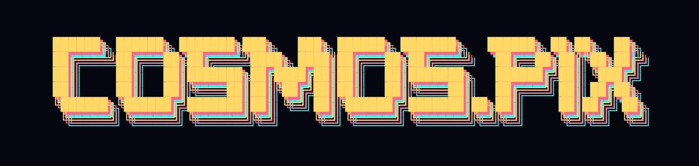
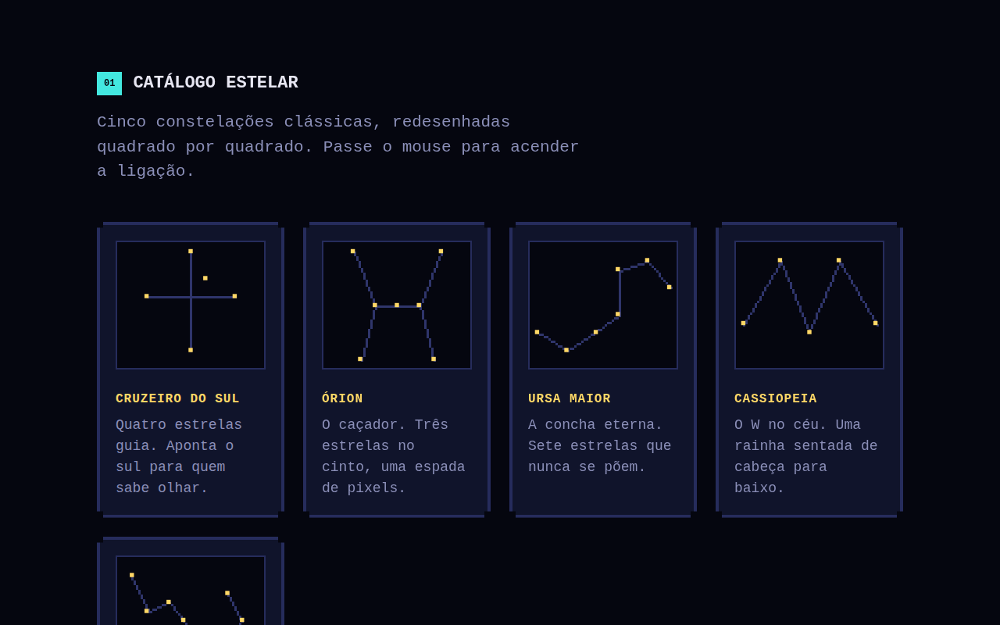

<p align="center">
  
</p>

<p align="center"><i>// um mapa estelar 8-bit — constelações clássicas e as suas, desenhadas quadrado por quadrado</i></p>

<p align="center">
  
  
  
  
</p>

<p align="center">
  
</p>

---

### ▸ índice

- [sobre](#-sobre)
- [preview](#-preview)
- [estrutura do projeto](#-estrutura-do-projeto)
- [como rodar](#-como-rodar)
- [funcionalidades](#-funcionalidades)
- [tecnologias](#-tecnologias)
- [compatibilidade](#-compatibilidade)
- [créditos](#-créditos)

---

### ▸ sobre

**COSMOS.PIX** transforma o céu noturno em uma grade de 8 bits. Sem fotografias, sem gradientes suaves — só quadrados, linhas retas em Bresenham e o mesmo instinto humano de sempre: conectar pontos de luz e contar uma história com eles.

O projeto tem três partes:

| ▪ | seção | o que faz |
|---|---|---|
| `01` | **Catálogo Estelar** | 5 constelações clássicas redesenhadas em pixel — passe o mouse e a ligação acende |
| `02` | **Desenhe a Sua** | uma grade em branco onde você clica para acender estrelas e ligá-las |
| `03` | **Minhas Constelações** | a galeria onde suas criações ficam salvas, direto no navegador |

---

### ▸ preview

<p align="center">
  
</p>

---

### ▸ estrutura do projeto

```
pixel-galaxy/
├── index.html     → estrutura da página
├── style.css      → tema visual pixel / retro
├── script.js      → animações, catálogo, criador e galeria
├── README.md      → este arquivo
└── print/        → imagens de preview
```

---

### ▸ como rodar

> ⚠ este projeto usa arquivos separados (HTML + CSS + JS) — abrir o `index.html` com **duplo clique** (`file://`) pode fazer o navegador bloquear o `script.js`. Sirva os arquivos por um servidor local:

```bash
# opção 1 — Python
python3 -m http.server 8000

# opção 2 — Node
npx serve .
```

Depois acesse **`http://localhost:8000`** no navegador.

**Sem terminal:** instale a extensão **Live Server** no VS Code → botão direito em `index.html` → *Open with Live Server*.

---

### ▸ funcionalidades

```
[x] campo de estrelas animado, com brilho e estrelas cadentes

[x] catálogo com 5 constelações clássicas (Cruzeiro do Sul, Órion, Ursa Maior, Cassiopeia, Escorpião), linhas em pixel via Bresenham

[x] criador interativo: clique para acender, clique de novo para ligar

[x] desfazer / aleatória / limpar

[x] galeria "Minhas Constelações" com salvamento e remoção

[x] persistência via localStorage — fecha a aba e continua lá

[x] 100% responsivo, do desktop ao celular
```

---

### ▸ tecnologias

- **HTML5 + CSS3** — sem frameworks, sem build step
- **JavaScript puro** — sem dependências externas
- **Canvas API** — todo o desenho pixelado, incluindo as linhas (Bresenham)
- **`localStorage`** — persistência das constelações criadas
- **Google Fonts** — `Press Start 2P` (títulos) + `VT323` (texto)

---

### ▸ compatibilidade

Roda em qualquer navegador moderno — Chrome, Firefox, Safari, Edge. Requer servidor local para carregar os 3 arquivos corretamente (ver [como rodar](#-como-rodar)).

---

<p align="center">
▪ ▪ ▪<br>
feito por <b>Allana Martins</b> © 2026
</p>